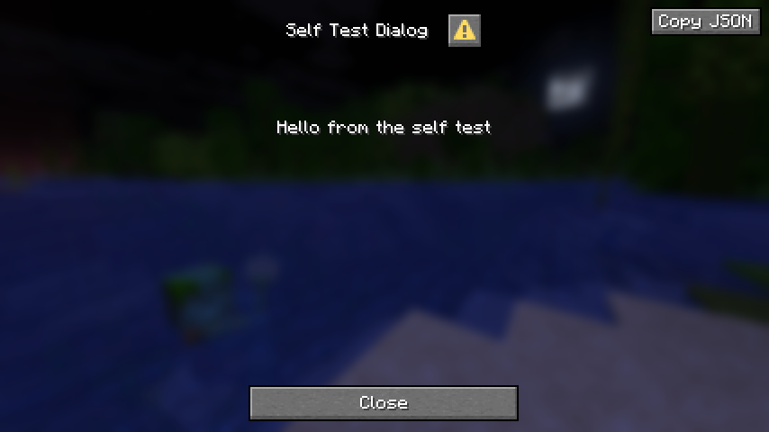

# DialogCopyMod

A small client-side [Fabric](https://fabricmc.net/) mod for **Minecraft 1.21.11** that puts a
**Copy JSON** button in the top right corner of every dialog screen (the dialogs added in 1.21.6).
Click it and the dialog's JSON — exactly the shape a datapack would ship — lands on your clipboard.

Handy when a server shows you a dialog and you want to know how it was built, or when you are
authoring dialogs yourself and want to snapshot what the client actually received.



## Features

### Hover any element to see what it does

Every button and input in a dialog gets a detail block under its tooltip, so you can tell what a
dialog will do before you click it:

```
A plain button                    <- the dialog author's own tooltip, kept

Runs command: say static hello
After: close
```

- **Action buttons** show the command they will run (or the URL, dialog, clipboard text, page or
  custom action id they will trigger), plus what happens to the dialog afterwards.
- **Dynamic commands** are shown *resolved against the inputs as they stand right now* — type a
  different name and the command in the tooltip changes with it — with the raw template underneath
  so you can see which inputs feed it.
- **Custom actions** show their id and the payload that would be sent.
- **Inputs** show their key, type and constraints: initial value, max length, option ids, range and
  step — the things a datapack author needs and a player never sees.

Whatever tooltip the dialog author wrote is kept, with the details hung underneath it.

### Copy the whole dialog

- Adds a **Copy JSON** button to the top right of every `DialogScreen` (notice, confirmation,
  multi-action, dialog list, server links and custom dialog types).
- Copies the dialog re-encoded through vanilla's own `Dialog` codec, so the output round-trips
  back into a valid dialog definition — pretty-printed for readability.
- Encodes against the registries the server sent, so item bodies and other registry-backed
  content serialize correctly.
- Slides left automatically if vanilla's warning button is already sitting in that corner.
- Shows a toast on success, and on failure (with the reason in the log) instead of failing silently.
- Client-side only. Nothing is sent to the server; servers cannot tell it is installed.

## Requirements

| | |
|---|---|
| Minecraft | 1.21.11 |
| Fabric Loader | 0.19.5 or newer |
| Fabric API | required |
| Java | 21 |

## Installing

1. Install [Fabric Loader](https://fabricmc.net/use/installer/) for 1.21.11.
2. Drop [Fabric API](https://modrinth.com/mod/fabric-api) into your `mods` folder.
3. Grab `dialogcopymod-<version>.jar` from the
   [Releases](https://github.com/Faboit1/DialogCopyMod/releases) page (or from the build
   artifacts of any [Actions run](https://github.com/Faboit1/DialogCopyMod/actions)) and drop it
   in `mods` too.

## Building

```bash
./gradlew build
```

The jar lands in `build/libs/`. GitHub Actions builds every push and pull request and uploads the
jar as a workflow artifact; pushing a `v*` tag (for example `v1.0.0`) also publishes a GitHub
release with the jar attached.

## How it works

`ScreenEvents.AFTER_INIT` from Fabric API spots any `DialogScreen` being initialised and adds the
button. A mixin accessor reads the screen's `dialog` field, `Dialog.CODEC` encodes it to JSON
against a `RegistryOps` built from the client's registry manager, and
`MinecraftClient.keyboard.setClipboard` does the rest.

## License

[MIT](LICENSE)
